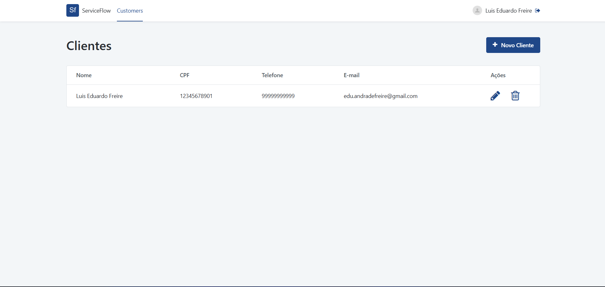
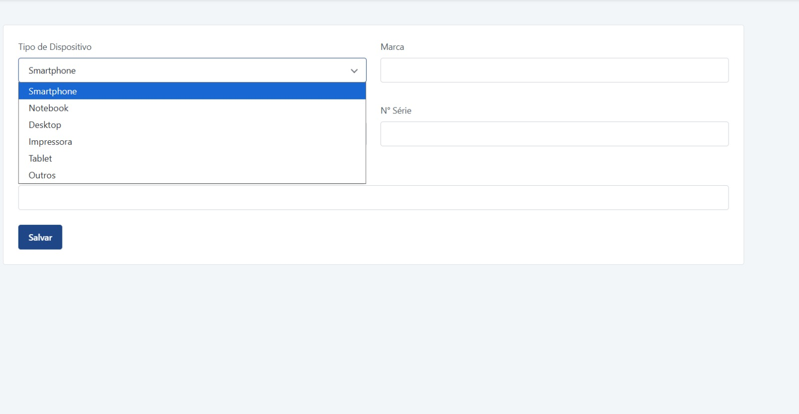
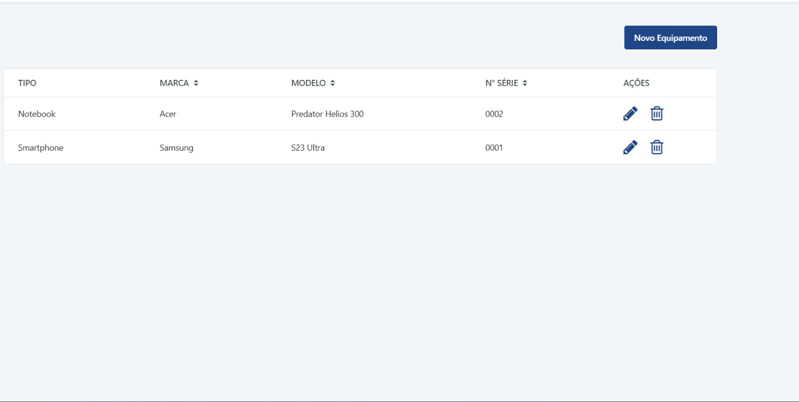

# ServiceFlow - OutSystems

Projeto prático desenvolvido em OutSystems para consolidar conceitos de arquitetura, CRUD, validações, tratamento de erros, auditoria e relacionamentos entre entidades.

## Objetivo

Construir uma aplicação de gestão de assistência técnica, permitindo o cadastro de clientes, equipamentos e, nas próximas etapas, ordens de serviço.

O projeto também está sendo utilizado como portfólio de estudos e evolução prática em OutSystems.

## Funcionalidades implementadas

### Customer

- Cadastro de clientes
- Edição de clientes
- Soft Delete
- Validação de campos obrigatórios
- Validação de CPF
- Validação de CPF duplicado
- Tratamento de erros
- Auditoria com CreatedOn, CreatedBy, UpdatedOn e UpdatedBy

### Device

- Relacionamento Customer → Device
- Cadastro de equipamentos
- Edição de equipamentos
- Soft Delete
- Listagem de equipamentos por cliente
- Validação de cliente
- Validação de tipo de equipamento
- Validação de marca e modelo
- Validação de Serial Number duplicado
- Tratamento de erros
- Auditoria com CreatedOn, CreatedBy, UpdatedOn e UpdatedBy

## Arquitetura

O projeto segue um padrão de separação de responsabilidades inspirado na Trusted Academy.

Exemplo utilizado nos módulos de Customer e Device:

- `Validation` — regras de validação
- `Save` — orquestração do fluxo
- `SaveCore` — persistência e auditoria
- `SoftDelete` — desativação lógica do registro

Esse padrão permite manter as regras de negócio organizadas e reaproveitáveis.

## Screenshots

### Customers
Tela de clientes com acesso aos equipamentos, edição e Soft Delete.

### Device List
Listagem dos equipamentos vinculados ao cliente selecionado.

### Device Detail
Cadastro e edição de equipamentos com validações de negócio.

